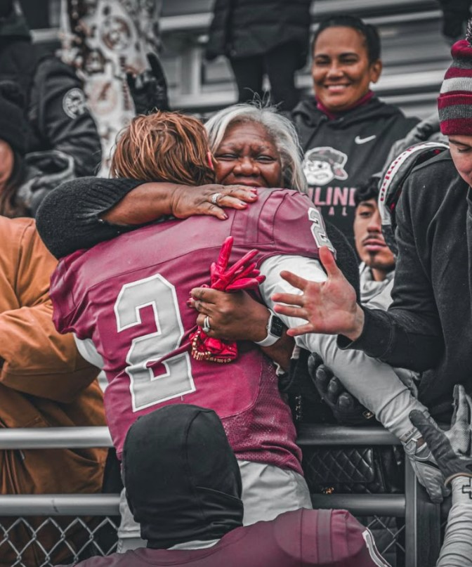
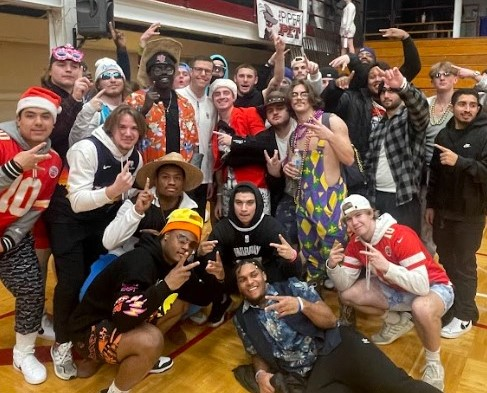
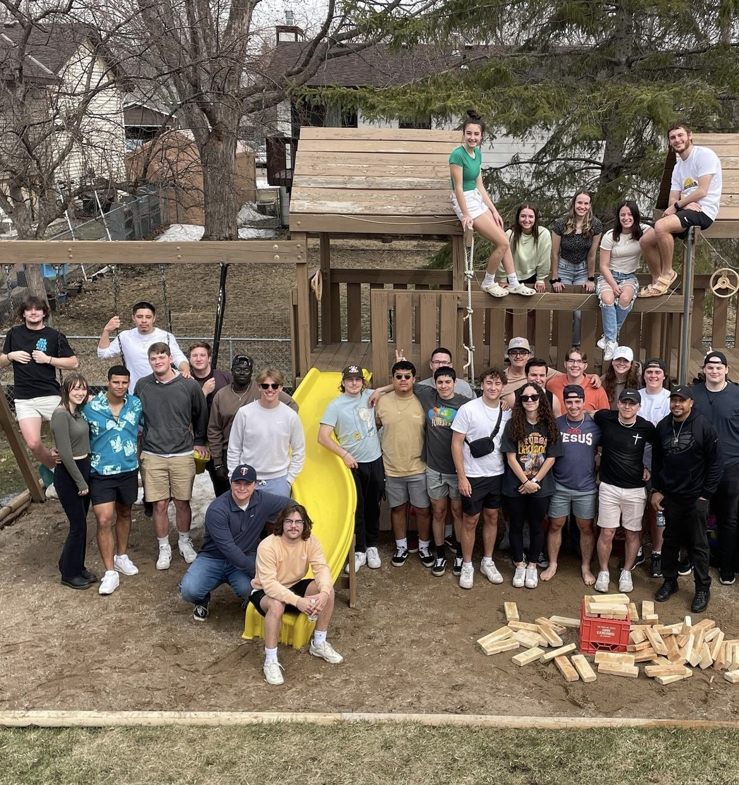

-   Awarded Fulforf-Karp Physics Scholarship

-   Awarded Kent H. Bracewell Research Scholarship

-   Award Rene and Brian McCoy Research Monarch Scholarship

-   Deans List all 8 semesters

-   MIAC Academic All-Conference all 6 eligible semesters

-   Elected Hamline Football Captain at 20 years old

    {width="571"}

-   During time as captain:

    -   Team won the "Piper Cup" - Athletic Department award for community service and support

    -   2nd Most wins in 20 Years

    -   Team achieved our GPA goal every semester

    -   Largest recruiting class in program history

    -   Personally recruited over 40% of team's current roster

    -   Awarded team "Most Committed" award

    -   Awarded team "Most Courageous" award

