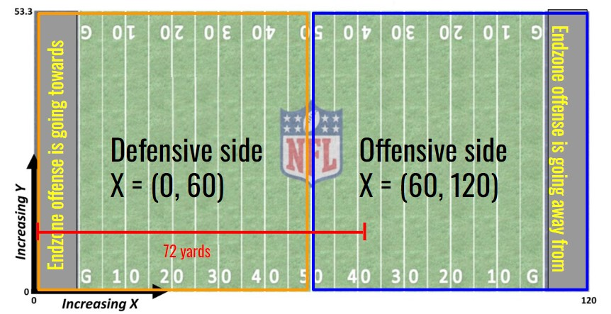
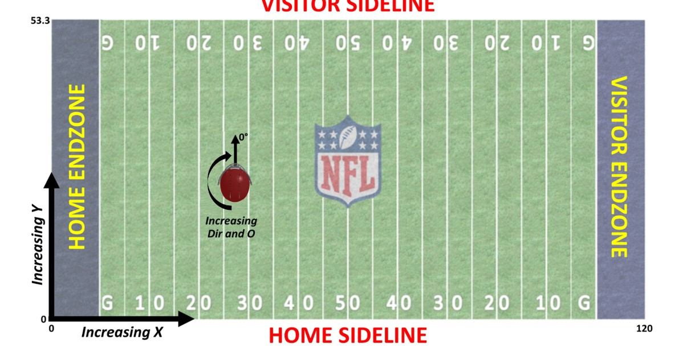
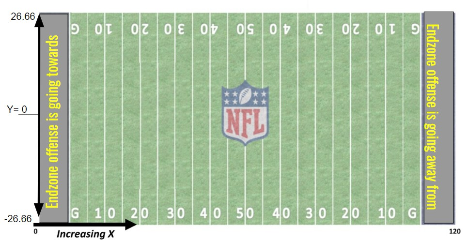

This document tackes in the data frame of tracking data of tackle_opps and produces the dataframe to model

```{r}
rm(list = ls())
library(devtools)
library(dplyr)
library(gganimate)
library(ggforce)
library(ggplot2)
library(readr)
```

```{r}
df<- read.csv('frame_of_tackle_opp_total.csv')
contact_df <- read.csv('contact_frame_tackle_opp.csv')
```

select only the columns we care about
```{r}
contact_df <- contact_df %>% select(tackle_oppId, displayName, x,y,s,a,dis,o, dir)
```

rename
```{r}
colnames(contact_df) <- c('tackle_oppId', 'displayName', 'x_ct','y_ct','s_ct','a_ct','dis_ct','o_ct', 'dir_ct')
```

```{r}
df<- df %>% merge(contact_df, all = TRUE)
```

drop the ones with missing data that we need
```{r}
df <- df %>% filter(!(is.na(x_ct)), !(is.na(x_ct)))
```


```{r}
length(unique(df$tackle_oppId))
```

First we need to add where the play occurred to our data set

```{r}
plays <- read.csv('plays.csv')
```

`plays_to_add` has the yardline the play started on, and the relevant features to merge

```{r}
plays_to_add <- plays %>% select(yardlineNumber, gameId, playId, yardlineSide) %>% filter(gameId %in% (unique(df$gameId)), playId %in% unique(df$playId))
```

```{r}
df <- df %>% merge(plays_to_add)
```

los will be the los scrimage location on the x axis. If the line of scrimage is on the defensive side, the ball is close to the endzone to score in.

```{r}
df$los = 0 

df<- df %>% mutate(los = ifelse(yardlineSide == defensiveTeam, yardlineNumber+10, 110-yardlineNumber  ))
```


```{r}
df %>% ggplot() + geom_histogram(aes(x =los))
```

```{r}
df[1,]
```

This play is at the 38 yardline on the offensive side of the field( `yardlineSide` != `defensiveTeam`) this means the line of scrimage is 72 yards from the back of the endzone they are going towards.



df is the data from the frames of a tackle opportunity occurring. We will begin to work with orientation, if play direction is not their, just remove

```{r}
df <- df %>% filter(!(is.na(playDirection)))
```

#### Create df to model with

Lets create a df that has just the tackler

```{r}
df_o_fix <- df  %>% filter(had_tackle_opp ==1 | has_ball == 1)
```

```{r}
length(unique(df_o_fix$tackle_oppId))
```

This is how many tackle occurrences we have



Currently, this is our orientation for player tracking. We want to change the orientation so each play is going the same direction.


To change this we need to change `dir` and `o`.

##### Ex. a play going to the right

Player is facing the right endonze. This player is facing the endzone the offense is going towards. We want this to be orientation 0. On the current orientation this is 90. Therefore Current Orientation - 90 is ideal orientation.

```{r}
df_o_fix[df_o_fix$playDirection == 'right',]$o = df_o_fix[df_o_fix$playDirection == 'right',]$o -90

df_o_fix[df_o_fix$playDirection == 'right',]$dir = df_o_fix[df_o_fix$playDirection == 'right',]$dir -90

df_o_fix[df_o_fix$playDirection == 'right',]$o = df_o_fix[df_o_fix$playDirection == 'right',]$o_ct -90

df_o_fix[df_o_fix$playDirection == 'right',]$dir = df_o_fix[df_o_fix$playDirection == 'right',]$dir_ct -90
```

##### Ex. a play going to the left

Player is facing the left endonze. This player is facing the endzone the offense is going towards. We want this to be orientation 0. On the current orientation this is 270. Therefore Current Orientation + 90 = 360 which is also 0 and ideal orientation.

```{r}
df_o_fix[df_o_fix$playDirection == 'left',]$o = df_o_fix[df_o_fix$playDirection == 'left',]$o +90

df_o_fix[df_o_fix$playDirection == 'left',]$dir = df_o_fix[df_o_fix$playDirection == 'left',]$dir +90

df_o_fix[df_o_fix$playDirection == 'left',]$o = df_o_fix[df_o_fix$playDirection == 'left',]$o_ct +90

df_o_fix[df_o_fix$playDirection == 'left',]$dir = df_o_fix[df_o_fix$playDirection == 'left',]$dir_ct +90
```

```{r}
df_o_fix %>% ggplot() + geom_histogram(aes(x = o))
```

Here is the distribution of orientation. This is in degrees so it should range from 0-360. But since we manually shifted, `o` did not reset at 0 and 360. We will need to manually fix this.

```{r}
df_o_fix <- df_o_fix %>% mutate(o = ifelse(o>359, o-360, ifelse(o<0, o+360, o)))
df_o_fix <- df_o_fix %>% mutate(o_ct = ifelse(o_ct>359, o_ct-360, ifelse(o_ct<0, o_ct+360, o_ct)))
```

```{r}
df_o_fix %>% ggplot() + geom_histogram(aes(x = o_ct))
```

Now `o` is in range 0-359. We can assume this is also an issue for the other degree shifted variables, and will fix those as well.

```{r}
df_o_fix <- df_o_fix %>% mutate(dir = ifelse(dir>359, dir-360, ifelse(dir<0, dir+360, dir)))

df_o_fix <- df_o_fix %>% mutate(dir = ifelse(dir_ct>359, dir_ct-360, ifelse(dir_ct<0, dir_ct+360, dir_ct)))
```

Now we need to flip the x coordinate. We are treating all plays as if they are going left. We need to subtract 120 from the plays going right

```{r}
df_o_fix[df_o_fix$playDirection == 'right',]$x = 120 - df_o_fix[df_o_fix$playDirection == 'right',]$x 
```

```{r}
df_o_fix[df_o_fix$playDirection == 'right',]$x_ct = 120 - df_o_fix[df_o_fix$playDirection == 'right',]$x_ct 
```


We also have to flip the y coordinate in the same manor, the max y is 53 1/3 so we will subtract by that

The location on the field does not provide much contect without refrence of where the play started. We will refrence x and y from where the ball started.

```{r}
df_o_fix$x_los <- df_o_fix$los - df_o_fix$x

df_o_fix$x_los_ct <- df_o_fix$los - df_o_fix$x_ct

```

This histogram reprents how far the tackles occur past hte line of scrimmage. The negative values are tackles behind the line of scrimmage.

For Y value we will do the same thing. This time the ball is in the center (53+(1/3))/2 so negative will represent one side of the field.



```{r}

df_o_fix$y_los <- df_o_fix$y - (53+(1/3))/2


df_o_fix$y_los_ct <- df_o_fix$y_ct - (53+(1/3))/2

```

now we will make a tackler_df

```{r}
df_bc <- df_o_fix %>% filter(has_ball == 1)
df_tackler <- df_o_fix %>% filter(had_tackle_opp == 1)
```


```{r}
head(df_bc, 1)
```

```{r}
df_bc <- df_bc %>% select("x_los", "y_los", "s", "a", "dis", "o", "dir", "x_los_ct", "y_los_ct", "s_ct", "a_ct", "dis_ct", "o_ct", "dir_ct","tackle_oppId") 
```

... And rename the tracking data of df_bc. This allows us to merge with the bc and tackler data seperate

```{r}
colnames(df_bc) <-  c("x_los_bc", "y_los_bc", "s_bc", "a_bc", "dis_bc", "o_bc", "dir_bc", "x_los_ct_bc", "y_los_ct_bc", "s_ct_bc", "a_ct_bc", "dis_ct_bc", "o_ct_bc", "dir_ct_bc","tackle_oppId")
```

```{r}
df_o_fix<- merge(df_tackler, df_bc, all = TRUE)
```

```{r}
df_o_fix %>% ggplot() + geom_histogram(aes(y_los))
```

Most tackles occur in the middle of the field and gradually decrease going outward. The symmetry suggests tackles occur in the spots regardless of side.

With that we want to normalize the y variable some more.

We normalize all tackles to occur on the left side of the field. This will take away the potential of catching a left or right side trend. But with football experience this would add little value compared to the potential additions a normalizition could add to our model. If the Ball Carrier has a negative `y_los` we will flip the play


```{r}
df_o_fix[df_o_fix$y_los_bc<0,]$o <- 360 - df_o_fix[df_o_fix$y_los_bc<0,]$o

df_o_fix[df_o_fix$y_los_bc<0,]$dir <- 360 - df_o_fix[df_o_fix$y_los_bc<0,]$dir

df_o_fix[df_o_fix$y_los_bc<0,]$y_los <- -1*(df_o_fix[df_o_fix$y_los_bc<0,]$y_los)

df_o_fix[df_o_fix$y_los_bc<0,]$o_bc <- 360 - df_o_fix[df_o_fix$y_los_bc<0,]$o

df_o_fix[df_o_fix$y_los_bc<0,]$dir_bc <- 360 - df_o_fix[df_o_fix$y_los_bc<0,]$dir

df_o_fix[df_o_fix$y_los_bc<0,]$y_los_bc <- 1*(df_o_fix[df_o_fix$y_los_bc<0,]$y_los_bc)


df_o_fix[df_o_fix$y_los_bc<0,]$o_ct <- 360 - df_o_fix[df_o_fix$y_los_bc<0,]$o_ct

df_o_fix[df_o_fix$y_los_bc<0,]$dir_ct <- 360 - df_o_fix[df_o_fix$y_los_bc<0,]$dir_ct

df_o_fix[df_o_fix$y_los_bc<0,]$y_los_ct <- -1*(df_o_fix[df_o_fix$y_los_bc<0,]$y_los_ct)

df_o_fix[df_o_fix$y_los_bc<0,]$o_ct_bc <- 360 - df_o_fix[df_o_fix$y_los_bc<0,]$o_ct_bc

df_o_fix[df_o_fix$y_los_bc<0,]$dir_ct_bc <- 360 - df_o_fix[df_o_fix$y_los_bc<0,]$dir_ct_bc
```

```{r}
df_o_fix[df_o_fix$y_los_bc<0,]$y_los_ct_bc <- 1*(df_o_fix[df_o_fix$y_los_bc<0,]$y_los_ct_bc)
```

```{r}
df_o_fix %>% ggplot() + geom_histogram(aes(y_los))
```


```{r}
df_o_fix$s_diff = df_o_fix$s - df_o_fix$s_bc
df_o_fix$a_diff = df_o_fix$a - df_o_fix$a_bc

df_o_fix$s_diff_ct = df_o_fix$s_ct - df_o_fix$s_ct_bc
df_o_fix$a_diff_ct = df_o_fix$a_ct- df_o_fix$a_ct_bc
```

```{r}

df_o_fix$x_diff = df_o_fix$x_los - df_o_fix$x_los_bc

df_o_fix$y_diff = df_o_fix$y_los - df_o_fix$y_los_bc

df_o_fix$o_diff  = df_o_fix$o_bc-df_o_fix$o

df_o_fix$x_diff_ct = df_o_fix$x_los_ct - df_o_fix$x_los_ct_bc

df_o_fix$y_diff_ct = df_o_fix$y_los_ct - df_o_fix$y_los_ct_bc

df_o_fix$o_diff_ct  = df_o_fix$o_ct_bc-df_o_fix$o_ct
```


```{r}
df_o_fix$dir_diff = df_o_fix$dir - df_o_fix$dir_bc

df_o_fix$dir_diff_ct = df_o_fix$dir_ct - df_o_fix$dir_ct_bc
```

```{r}
head(df_o_fix,3)
```

```{r}
df_to_model <- df_o_fix %>% select( "tackle_oppId","tackle","s_diff","a_diff","x_diff", "y_diff", "o_diff", "o", "x_los_ct","y_los_ct","s_diff_ct","a_diff_ct","x_diff_ct", "y_diff_ct", "o_diff_ct", "o_ct", 'dir_diff', 'dir_diff_ct' )         

```

```{r}
df_to_model
```


```{r}
length(unique(df_to_model$tackle_oppId))
```

```{r}
write.csv(df_to_model, 'df_to_model_total.csv', row.names=FALSE)
```
