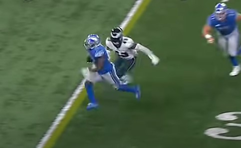

```{r setup, include=FALSE}
knitr::opts_chunk$set(echo = TRUE)
```

```{r}
rm(list = ls())
# These lines load packages
library(caret)
library(randomForest)
library(gbm)
library(DALEX)
library(pROC)
library(AppliedPredictiveModeling)
library(tidyverse)
library(performanceEstimation)
library(glmnet)
library(auditor)
```


```{r}
data <- read_csv("df_to_model_total.csv", show_col_types = FALSE)
```

```{r}
data<- data %>% select(-s_diff_ct,-x_diff_ct,-y_diff_ct,-o, -dir_diff_ct)
data <- data %>% drop_na()
```

```{r}
set.seed(1122)
samp = caret::createDataPartition(data$tackle, p = 0.7, list = FALSE)
train = data[samp, ]
test = data[-samp, ]
rm(samp)
```

```{r}
train$tackle = as.factor(train$tackle)

```

```{r}
set.seed(69)
train.bal = smote(tackle ~ .,
                  data = train,
                  perc.over = 3,
                  perc.under = 1.5)

# After using SMOTE to balance training
# data, lets inspect the new counts.
train.bal %>%
  select(tackle) %>%
  table() 
```
Load in gbm model
```{r}
gbm_model <- readRDS('nfl_gbm_model_total_Jan_less.rds')
gbm_explain = DALEX::explain(model = gbm_model,
                             data = test,
                             y = test$tackle==1,
                             type = "classification",
                             label = "GradientBoost")
```

Load in rf model
```{r}
rf_model<- readRDS('rf_model_total_Jan6_less.rds')
rf_explain = DALEX::explain(model = rf_model,
                            data = test,
                            y = as.numeric(test$tackle=="1"),
                            type = "classification",
                            label = "Random Forest")
```
We will create a list of all numbers the cuttoff could possibly by, and then get the recall and the specificity


```{r}

```


```{r}
numbers <- seq(from = .01, to = 1, by= .01)
```

```{r}
gbm_spec <- c()
gbm_recall <- c()
rf_spec <- c()
rf_recall <- c()

for (num in numbers){
  #spec of gbm
  s<- score_specificity(gbm_explain, cutoff = num)
  gbm_spec<- c(gbm_spec,s[[2]])
  
   #recall of gbm
  s<- score_recall(gbm_explain, cutoff = num)
  gbm_recall<- c(gbm_recall,s[[2]])
  
   #spec of rf
  s<- score_specificity(rf_explain, cutoff = num)
  rf_spec<- c(rf_spec,s[[2]])
  
   #recall of rf
  s<- score_recall(rf_explain, cutoff = num)
  rf_recall<- c(rf_recall,s[[2]])
  
  
  
  
  
}
```


```{r}
gbm_pref_df<- data.frame(cutoff = numbers, recall = gbm_recall, specificity = gbm_spec)
rf_pref_df<- data.frame(cutoff = numbers, recall = rf_recall, specificity = rf_spec)
```


Accuracy is not an accurate representation for the success of our model. There are significantly more tackles than missed tackles. The highest accuracy models would have the best recall- correctly predicting made tackles. As seen below a high recall does not capture the negative values well. We want to find the cut off value that recall and specificity is maximized. 


```{r}
ggplot(gbm_pref_df)+ geom_line(aes(x = numbers, y = recall), color = 'darkblue')+ geom_line(aes(x = numbers, y = specificity), color = 'orange')+labs(title = 'GBM Model')
```

```{r}
gbm_pref_df$diff <- abs(gbm_pref_df$recall- gbm_pref_df$specificity)
gbm_pref_df <- gbm_pref_df %>% drop_na()
```


```{r}
gbm_pref_df %>% filter( diff == min(gbm_pref_df$diff))
```
So apprantley recall and specificity is optomized at cutoff .73 
```{r}
gbm_perf = DALEX::model_performance(gbm_explain, cutoff = 0.25)
gbm_perf
```


```{r}
ggplot(rf_pref_df)+ geom_line(aes(x = numbers, y = recall), color = 'darkblue')+ geom_line(aes(x = numbers, y = specificity), color = 'orange')+labs(title = 'RF Model')
```


```{r}
rf_pref_df$diff <- abs(rf_pref_df$recall- rf_pref_df$specificity)
rf_pref_df <- rf_pref_df %>% drop_na()
```


```{r}
rf_pref_df %>% filter( diff == min(rf_pref_df$diff))
```

```{r}
rf_perf = DALEX::model_performance(rf_explain, cutoff = 0.31)
rf_perf
```

```{r}
lift_curve <- plot(rf_perf, gbm_perf, geom = "lift")
```

```{r}
plot(lift_curve)
```

ROC is not a good measure because we also care about the negatives see page 336

RF has a better recall and specifictity when optimized, we will move forward with that model. 

```{r}
rf_mp = DALEX::model_parts(rf_explain,
                           B = 50)


plot(rf_mp, max_vars = 8)
```


```{r}
frame_of_tackle <- read.csv('frame_of_tackle_opp_w123.csv')
```

```{r}
frame_of_tackle %>% filter(displayName =="D'Andre Swift", has_ball == 1, defensiveTeam == 'PHI')
```

```{r}
 frame_of_tackle %>% filter(tackle_oppId == 4791, had_tackle_opp ==1) %>% select(tackle_oppId, displayName, jerseyNumber, tackle)
```
#had to add the 1000 from when the indexing was messed up 
```{r}
gbm_shap_24 = DALEX::predict_parts_shap(rf_explain, data[data$tackle_oppId==14791,], B=25)
```

```{r}
prob_24 = predict(rf_model, newdata = data[data$tackle_oppId==14791,], type="prob")[,2]
```


After watching the film over a few times a coach would have these coaching points for why #24 missed this tackle.

1.  Don't stop your feet! - Keep moving at the runner!

    -   Analytically- `x_s_diff`, `y_s_diff` ,`x_adiff` ,`y_adiff` are too large

2.  It is difficult when he is running so straight. Take him straight on! (This is a difficult ask to tackle a runner so straight or "downhill")

    -   Analytically- #24's `o` is running very straight (near 360) which adds to the difficult


The model correclty predicts this would be a missed tackle.

Coaching point 1 is captured very well by the model, with `x_s_diff`, `y_s_diff` ,`x_adiff` ,`y_adiff` all being reasons to predict the tackle as missed.

Coaching point 2 is captured well with `o_bc` being close to 360 being a significant issue.

#### Tackle Oppurtunity 2- #43 misses tackle

```{r}
frame_of_tackle %>% filter(tackle_oppId == 4792
              , had_tackle_opp ==1) %>% select(tackle_oppId, displayName, jerseyNumber, tackle)

```

```{r}
rf_shap_43 = DALEX::predict_parts_shap(rf_explain, data[data$tackle_oppId==14792,], B=25)
```



On this tackle opportunity an announcer would say something like "Man, I thought he was for sure tackled here. Incredible play from Swift to accelerate break this tackle"

The coaching points for #43 would be.

1.  Great angle and lateral pursuit to force this ball toward the sideline

    -   Analtyically- because `y_s_diff` was good this forced `dis_from_los_y` to be high, which makes it a more likely tackle

2.  Tackler was a bit too far away for a tackle attempt, that's why it was a difficult from-behind dive tackle

    -   Analytically- `x_diff` and `y_diff` were too high which forced `o` to be a problem.

```{r}
prob_43 = predict(rf_model, newdata = data[data$tackle_oppId==14792,], type="prob")[,2]
```

```{r}
plot(gbm_shap_43) + 
  ggtitle(paste("SHAP for #43: Prob =", round(prob_43,3)))
```


Redoo write up 
#### Tackle Opportunity 3- #2 makes tackle

```{r}
frame_of_tackle %>% filter(tackle_oppId == 4790
              , had_tackle_opp ==1) %>% select(tackle_oppId, displayName, jerseyNumber, tackle)
```

```{r}
rf_shap_2 = DALEX::predict_parts_shap(rf_explain, data[data$tackle_oppId==14790,], B=25)
```

```{r}
prob_2 = predict(rf_model, newdata = data[data$tackle_oppId==14790,], type="prob")[,2]
```


Number 2 for the eagles is one of the best tackles in the game. No suprise he makes this tackle. This is what coaches call "teach tape" as in this is a perfectly done play that they would show to other players and coaches to learn from.

The coaching points for others to learn from.

1.  Great angle to cut him off

    -   Analytically- great `o` relative to `o_bc` which is called `o_diff`

2.  Great job to keep your feet moving, and continue moving at him

    -   Good `y_s_diff` to force a beneficial `y_diff`

3.  Good job using the sideline to your advantage

    -   Being close to the sideline, `dis_from_y` makes the tackle an easier tackle

```{r}
plot(rf_shap_2) + 
  ggtitle(paste("SHAP for #2: Prob =", round(prob_2,3)))
```

The model correctly identified this as a well executed tackle with a probability of .998. It identified the excellent angle with the `o_diff` and the great lateral pursuit with beneficial `y_s_diff` and `y_diff` while also aknowledging the benefit of being near the sideline `dis_from_los_y`


test

```{r}
gbm_shap_24 = DALEX::predict_parts_shap(rf_explain, data[data$tackle_oppId==14791,], B=25)
```

```{r}
prob_24 = predict(rf_model, newdata = data[data$tackle_oppId==14791,], type="prob")[,2]
```

```{r}
plot(gbm_shap_24, add_boxplots = FALSE) + 
  ggtitle(paste("SHAP for #24: Prob =", round(prob_24,3)))
```

```{r}
break_down<- DALEX::predict_parts_break_down(rf_explain, data[data$tackle_oppId==14791,], B=25)
```

```{r}
plot(break_down)+ggtitle(paste("SHAP for #24: Prob =", round(prob_24,3)))
```
```{r}
break_down_slay<- DALEX::predict_parts_break_down(rf_explain, data[data$tackle_oppId==14790,], B=25)
```

```{r}
prob_slay = predict(rf_model, newdata = data[data$tackle_oppId==14790,], type="prob")[,2]
```


```{r}
plot(break_down_slay)+ggtitle(paste("SHAP for Slay: Prob =", round(prob_slay,3)))
```

```{r}
break_down_slay<- DALEX::predict_parts_break_down(rf_explain, data[data$tackle_oppId==14792,], B=25)
```

```{r}
prob_slay = predict(rf_model, newdata = data[data$tackle_oppId==14792,], type="prob")[,2]
```


```{r}
plot(break_down_slay)+ggtitle(paste("SHAP for 43: Prob =", round(prob_slay,3)))
```

