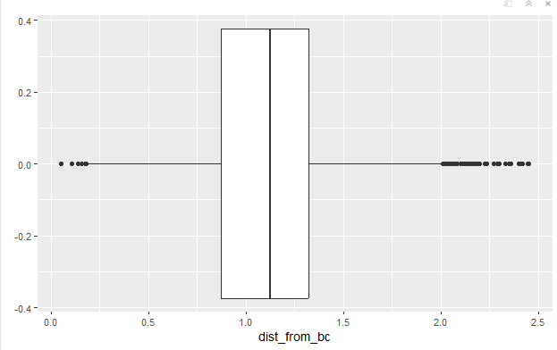

This document takes in raw tracking data and produced a dataframe of each tackle_opp tracking data for all players.

```{r}
# * load packages ----
rm(list = ls())
library(devtools)
library(dplyr)
library(gganimate)
library(ggforce)
library(ggplot2)
library(readr)
```

Next we need to mark in tracking data the offensive and defensive teams

```{r}
#this is a massive data set that would take too long to run
#tracking<- read.csv('tracking_total.csv')
```

```{r}
#players<- read.csv('~/repos/zgriebel.github.io/projects/NFL Tackling Evaluation/players.csv')
#plays <- read.csv('~/repos/zgriebel.github.io/projects/NFL Tackling Evaluation/plays.csv')
#tackles<- read.csv('~/repos/zgriebel.github.io/projects/NFL Tackling Evaluation/tackles.csv')
#games <- read.csv('~/repos/zgriebel.github.io/projects/NFL Tackling Evaluation/games.csv')

```

```{r}
#defensive_team_play <- plays %>% select(gameId, playId, defensiveTeam)

#then merge to tracking data to get who is on defense
#tracking <- merge(tracking, defensive_team_play, all = TRUE)

#tracking <- mutate(tracking, on_defense = case_when(club == defensiveTeam ~ 1, club != defensiveTeam ~ 0))
```

```{r}
library(stringr)
#tracking$game_playId = 0
#tracking$game_playId <- str_c( as.character(tracking$gameId), as.character(tracking$playId), sep = '-')

#head(tracking)
```

Now we want to mark who the offensive ball carrier is.

We will need to use the df plays, and alter the IDs for quicker run through.

```{r}
library(stringr)
#plays$game_playId <- str_c( as.character(plays$gameId), as.character(plays$playId), sep = '-')
```

Lets add when the player is a ball carrier

```{r}
#filter by games in our tracking data
#bc_df<- plays %>% filter(gameId %in% unique(tracking$gameId)) %>% select(game_playId, ballCarrierId)
```

```{r}
#this is also a large data set
#it is all tracking data of who is marked as a ball carrier
#bc_df
```

```{r}
#colnames(bc_df) <- c("game_playId","nflId")
```

```{r}
#flag ball carrier
#bc_df$has_ball = 1
```

Now we will merge the dataset with our tracking data. The only new column will be has ball

```{r}


#tracking <- merge(tracking, bc_df, all = TRUE)
```

```{r}
#head(tracking)
```

Next we want to calculate defenders distance from the ball carrier. Much like dist_from_ball calculations

```{r}
get_dist_from_bc <- function(game_playId, frame) {
  #ball data is the football location
bc_data <- play_data[play_data$has_ball ==1,]
  #get x and y coordinate#
bc_x <- bc_data[bc_data$frameId == frame,]$x
bc_y <- bc_data[bc_data$frameId == frame,]$y
#data of just the players at the given frame
player_data <- frame_data %>% filter(has_ball == 0 & displayName != 'football' )
player_data$dist_from_bc <- sqrt(((bc_x-player_data$x)^2)+((bc_y-player_data$y)^2))
#distance formula player to ball

player_data <- player_data %>% select('game_playId', 'nflId', 'frameId', 'dist_from_bc')
#select only the necessary variables to simplify join
player_data
#set the function equal to a dummy table and then join with tracking for efficient 
}
```

This kernel takes a long time to run.

```{r}


#tracking$dist_from_ball = 0
#bc_dist_frame_table <- data.frame(matrix(ncol = 4, nrow = 0))

#provide column names
#colnames(bc_dist_frame_table) <- c('game_playId', 'nflId', 'frameId', 'dist_from_bc')
#play_num = 0

#all individual games from this dataset. It is 16 for week 1

#for (play in unique(tracking$game_playId) ) {
  #this took some time
 # play_num = play_num +1
  #print(play_num)
  #play_data<- tracking %>% filter(game_playId == play)
      #play data is for this specifc play
   #   for (frame in unique(play_data$frameId)){
        #iterate accross frames
    #    frame_data <- play_data %>% filter(frameId == frame)
        #create frame data
     #   has_ball_marker <- frame_data %>% filter(has_ball==1) %>% pull(has_ball)
        #= 1 if there is a player with the ball
      #  if (length(has_ball_marker) > 0) {
          #if there is a player with the ball calculate
       # frame_dist_bc_data<-get_dist_from_bc(game_playId = play, frame = frame)
        #returns the data from individual frame
        #add to running table
        #bc_dist_frame_table <- rbind(bc_dist_frame_table, frame_dist_bc_data)}}}


```

```{r}
#length(unique(tracking$game_playId))
```

```{r}
#write.csv(bc_dist_frame_table, "bc_dist_total.csv", row.names=FALSE)
```

```{r}
#write.csv(tracking, 'tracking_w789.csv', row.names=FALSE)
```

This is a df of each players distance from bc for every frame

The length of `bc_dist_frame_table` is shorter because we filtered out when the ball is not in play.

Next we will make a column `game_play_frameId`. This is an id for each individual frame

```{r}

#bc_dist_frame_table <- read.csv('bc_distJan3.csv')
#tracking<- read.csv('tracking_week1Jan3.csv')
#tracking$game_play_frameId = 0
#tracking$game_play_frameId <- str_c( as.character(tracking$game_playId), #as.character(tracking$frameId), sep = '-')

#bc_dist_frame_table$game_play_frameId = 0
#bc_dist_frame_table$game_play_frameId <- str_c( as.character(bc_dist_frame_table$game_playId), #as.character(bc_dist_frame_table$frameId), sep = '-')

#bc_dist_frame_table<- bc_dist_frame_table %>% select(c('game_play_frameId', 'dist_from_bc', 'nflId'))
#head(bc_dist_frame_table)
```

Our `bc_dist_frame_table` is smaller because the ball carrier is not included

```{r}
#tracking <- merge(tracking, bc_dist_frame_table, all = TRUE)
```

```{r}
#tracking
```

Some mergine using keep all added some extra data points we had already filtered out. These have displayName as NA. Filtering these out cleans our data set back to the original length

```{r}
#tracking <- tracking %>% filter(!is.na(displayName))
```

`dist_from_bc` is NA for the tracking of the football.

```{r}
#tracking %>% filter(displayName == 'football') %>% ggplot()+ geom_histogram(aes(s))
```

We want only when the ball is in play

```{r}
#frames_not_inplay <- tracking %>% filter(displayName == 'football', s==0) %>% pull(game_play_frameId) 
```

```{r}
#tracking <- tracking %>% filter(!(game_play_frameId %in% frames_not_inplay))
```

Now we need to add in the statistics about tackling. First filter by only the games we have in our tracking data set

We just want tackle or missed tackle. A longer discussion is in the final write up about why we will exclude missed tackles

```{r}
#tackles <- tackles %>% filter(gameId %in% unique(tracking$gameId))
#tackles <- tackles %>% filter(!(assist == 1))
#tackles$had_tackle_opp =1 
#tracking <- tracking %>% merge(tackles, all = TRUE)
```

```{r}
#tracking %>% filter(gameId == 2022091113, nflId == 47996	, playId == 413) %>% ggplot() + #geom_point(aes(x = frameId, y = dist_from_bc)) + labs(title = ' Tackler-play 413')

```

Earlier we found that a player has made contact in this data set at .975 from the ball. For simplicity we will use 1. At an estimate 1 yard away from the ball the tackler is considered "has made contact". We will analyze the frame before contact to predict if a player makes the tackle or not.

```{r}
#frame_of_tackle_opp  <- data.frame(matrix(ncol = 29, nrow = 0))
#colnames(frame_of_tackle_opp) <- colnames(tracking)
#print(length(unique(tracking$game_playId)))
#counter = 0 
#for (game_play in unique(tracking$game_playId)){
  #for each game id combo
 # counter = counter + 1
  #print(counter)
  #play_data <- tracking %>% filter(game_playId == game_play)
  
 
  
 # players_w_tackle_opp <- play_data %>% filter(had_tackle_opp ==1)
#  if (length(players_w_tackle_opp$nflId)>0){
  #if the player has a tackle opp
 # for (player in unique(players_w_tackle_opp$nflId)) {
  #  counter = counter + 1
  #print(counter)
    #go thru list of players with opp
   # player_data <-  play_data %>% filter(nflId == player)
    
    #the frame that the tackler is closest to ball carrier is assumed to be when tackle opp occured. All frames that happen after that are after the opp occured or after the play finished. We do not want that in our data
    #frame_min_dist_bc <- player_data %>% filter(dist_from_bc == min(player_data$dist_from_bc)) %>% pull(frameId)
    
    #player_data %>% filter(frameId <= frame_min_dist_bc)
    

  #1 is the distance for when a player is considered in contact as shown above
  #we will find the frame to consider "made contact"
      #player_data$dev_median <- abs(player_data$dist_from_bc - 1)
      #player_contact_frame <- player_data %>% filter( dev_median == min(player_data$dev_median)) %>% pull(frameId)
      
      #player_contact_id <- player_data %>% filter( dev_median == min(player_data$dev_median)) %>% pull(nflId)
      
      #player data when the distance from ball is closest to the median
      #we are essentially projecting when contact is made
      #at this frame filter the tracking data, this is when contact is made
      #player_frame_to_keep <- player_contact_frame[1]-1
      #dummy_table <- tracking %>% filter(game_playId == game_play, frameId == player_frame_to_keep)
      
      
      #flag player who is tackler
      #if (length(unique(dummy_table$nflId)>22)){
       # plays like out of bounds have been previously filtered to where the dummy set will come up empty. This assures a clean dummy set is being entered with all 22 players
        
        #this gives each tackle opp an id
      #dummy_table$tackle_oppId <- counter
      
      #remove football from data set
      #dummy_table <- dummy_table %>% filter(displayName != 'football')
      
      #reset had tackle opp to 0
      #dummy_table$had_tackle_opp = 0
      #dummy_table[dummy_table$nflId == player_contact_id,]$had_tackle_opp = 1
      
      #frame_of_tackle_opp <- rbind(frame_of_tackle_opp, dummy_table)} }}}
  
#write.csv(frame_of_tackle_opp, 'frame_of_tackle_opp.csv', row.names=FALSE)
```

```{r}
#frame_of_tackle_opp <- read.csv('~/repos/zgriebel.github.io/projects/NFL Tackling Evaluation/frame_of_tackle_opp_total.csv')
```

```{r}
#frame_of_tackle_opp %>% filter(had_tackle_opp == 1) %>% ggplot() + geom_boxplot(aes(x = dist_from_bc))

```



```{r}
#write.csv(frame_of_tackle_opp, 'frame_of_tackle_opp_total.csv', row.names=FALSE)
```
