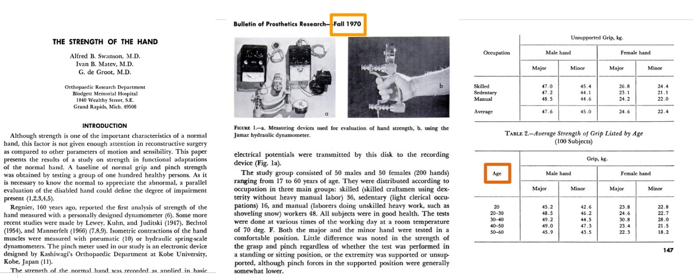
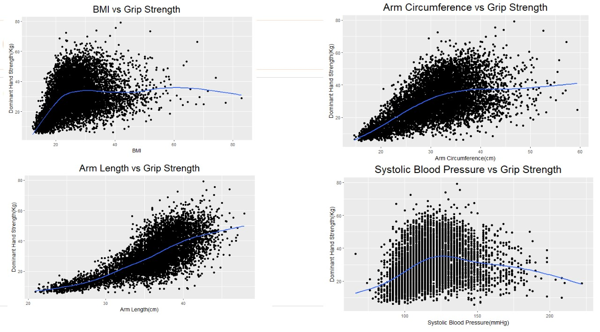
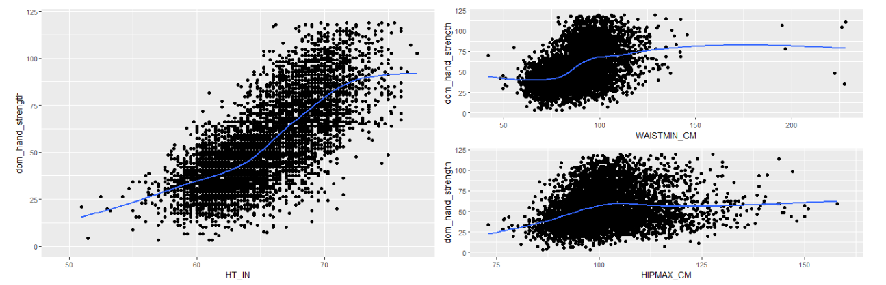
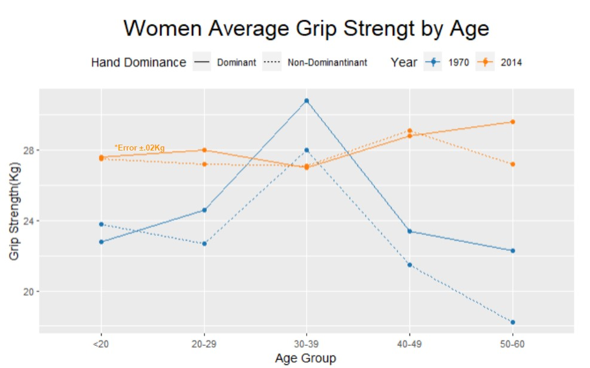

---
title: "Redefining the Grip Strength Standard"
format: html
editor: visual
---
## Problem

Grip-Strength is a measurable that is used in medical diagnoses and analysis in a variety of applications. Current literature links grip strength in being a strong indicator with Cardiovascular disease. Higher Grip strength is associated with better mental health and earlier death. And the average cost of hand/finger work injury compensation claims is \$25,904

### How are grip-strength results evaluated?

A protocol using a Dynamometer measures grip-strength.


Grip-Strength results are compared to the AMA normative values to determine deviation from normal. The normative values were determined in 1970 and use just one feature; age, to stratify the normative values.



### Thesis

The current normative values used by the American Medical association are insufficient and out-dated, this has the potential for misdiagnosis or misevaluation for financial compensation.

### Misevaluation Example

Evaluating strength loss from an injury is how work compensation claims are valued. This claim is how injured workers can for their medical bills, make up for lost wages and can be compensated for permanent impairment. As stated above these claims have serious financial implications behind them.

The example case of a evaluation is two 28 year old males with different body types and backgrounds. A non-injured Sedentary worker and an injured manual laborer. The American Medical Association determines the normative grip strength is 48.5Kg for males in the 20-30 age range.


In this scenario the sedentary worker is incorrectly diagnosed as **Injured.** This could prompt wasted resources attempting to diagnose the injury. This additionally would lead to wrongfully receiving work injury compensation for an injury that does not occur. Conversely, the manual laborer has a permanent injury and strength loss that will effect him the rest of his life. Due to inadequate data from the American Medical Association this laborer will not receive proper assistance because he is incorrectly identified as **Non-Injured**.

### Hypothesis 1

\- **Additional factors then age should be considered for grip strength comparison .**

```{r}
library(tidyverse)
#df <-read.csv('features_df.csv')
#head(df)
```

This data set has already been joined and cleaned.

has 7,878 subjects with 59 features. The patients are from a singular study in a specific radius of location. This data is **not** completely random and **does not** accurately represent America's population as a whole. For that reason there will be no attempt to redefine normative values. This data will be for analyzing feature relationships. While advanced analysis and decisions were made, the purpose of this project is to visualize support of the claims to the medical community.

Data was further cleaned and modeled using Subset Selection to find the most relevant features in predicting dominant hand grip-strength.

```{r}
#regfit_full <- regsubsets(DOM_AVG~.,data = men_test)

```


It was found the best predicting Variables in order are:

1.  Arm Length

2.  Age

3.  Arm Circumference

4.  BMI

5.  Systolic Blood Pressure

Age is **not** the first feature selected by the model, and there are additional features that significantly increase accuracy.



The four features above that are not `Age` have positive correlations with grip-strength and backs up the claim that there are other features related to grip-strength.

#### Analyze correlation of other features vs grip-strength

```{r}
#p1 <- ggplot(df, aes(x=HT_IN , y = dom_hand_strength))+geom_point()+geom_smooth(se = FALSE)+ylim(0,120)

#p2<-ggplot(df, aes(x= WAISTMIN_CM, y = dom_hand_strength))+geom_point()+geom_smooth(se = FALSE)+ylim(0,120)

#p3<-ggplot(df, aes(x= HIPMAX_CM, y = dom_hand_strength))+geom_point()+geom_smooth(se = FALSE)+ylim(0,120)

#p4<-ggplot(df, aes(x= SBP1 , y = dom_hand_strength))+geom_point()+geom_smooth(se = FALSE)+ylim(0,120)

#p5<-ggplot(df, aes(x=DBP1 , y = dom_hand_strength))+geom_point()+geom_smooth(se = FALSE)+ylim(0,120)

#p6<-ggplot(df, aes(x= PULSE_30, y = dom_hand_strength))+geom_point()+geom_smooth(se = FALSE)+ylim(0,120)

#p7<-ggplot(df, aes(x= FATPERC, y = dom_hand_strength))+geom_point()+geom_smooth(se = FALSE)+ylim(0,120)

```

#### 

The goal of individual feature charts is to look for a trend line within with some kind of correlation through the dense part of graph

```{r,fig.width=15,fig.height= 5}
library(patchwork)
#p1+p2/p3
```



Height, BMI and Waist measurement all have positive correlation with Grip-Strength

```{r,fig.width=15,fig.height= 5}
#p4+p6/p7
```


Within the dense part of these graphs Pulse, Body Fat Percent and Age have negative correlations with Grip-Strength.

We can see there are other variables that are related to grip-strength and utilizing more than just `age` would help the medical community diagnose more accuratley.

#### Specific Predicting Ability

When stratifying by age group and utilizing multiple features, models can predict grip-strength far more accurately. Above 60 years of age was used in the below graph because the most complete and largest data is a senior population dataset. 

The goal of this model was to analyze feature selection and the benefits of adding features other than age. Age once again was second to a body length measurement. And adding body composition statistics significantly raised our RSQ that suggests with some more work a model could get relatively accurate predictions.

#### Conclusion on Hypothesis - 1

Age may not be the best singular predictor for grip-strength and there are multiple features that significantly adds accuracy when predicting grip strength. With the gravity in a patient's compensation is placed on comparing to AMA normative values, additional features should be considered to ensure patients get categorized properly.

### Hypothesis 2

**- In the last 50 years the average human body has changed**


We have all heard that technology has changed the average American body. As a population we have less manual jobs, obesity is far higher and our postures have been altered. The AMA study that defines normative grip strength was from 1970, over half a century ago. So the question needs to be asked, have humans developed enough that the AMA normative values are outdated?

#### Data Analysis


The average grip strength for this population from 1970 is higher than 2014. This aligns with the hypothesis that Americans have begun working less manual jobs along with less physical activity and have consequently become weaker.



In general women in 2014 are stronger than women in 1970. Socially there has been a clear shift in gender roles from 1970 to today society and this could be one explanation for the distinction. As for the spike in 1970 ages 30-39. The scope of this study is not focused on causes of the anomaly, and more research would need to be done.

Women today are found to be stronger than when the original study was done and Men today are found to have gotten weaker. As stated above this is not a complete random summary of the United States. For that reason findings of both men and women can only strongly suggest that the Average American's grip strength has significantly changed since these normative values were determined.

## Final Conclusion

Determining a patient's Grip-Strength deviation from normal is critical to many medical processes. However, the determined normal may be inadequate data. The results from this project suggest that the normal values are outdated and too general. The recommendation is that a new study be preformed to determine new normal values with additional measurements. All of this would be to ensure patients receive the proper care they require.
