# **Tackle Probabilty Feature Analysis For Coaching And Evaluation**

## **Introduction**

This group has a unique appreciation and understanding of tackling. All three of us are undergraduate students who play football at our university. Between us we have 60 collegiate starts, over 200 collegiate tackles and definitely a few too many missed tackle as well. Our head coach always says "The best defenses are the best tacklers" and "good defense is how you win football games". However, it is simply not that easy, we spend valuable time in practice and in film breakdown learning and correcting the techniques of tackling. Coaching tackling techniques is one of the most debated aspects of defensive football and it is the coaching topic that players are constantly seeking. However, on game day, typically coaches are occupied with their game day roles like play calls or substitutions to provide correct, meaningful feedback from tackle opportunity. Quality tackling is complex, it often takes a coach or player multiple playbacks of watching film after the game to fully evaluate or correct a tackle opportunity. That is why the purpose of this project is to quickly and quantitatively answer the most common question we ask our teammates and coaches, "What happened, did you see how I missed that tackle?"

To answer this question we will create a model with predicting features that are easy to interpret and correlate to coaching points of tackling. Then we will preform feature analysis of an individual tackle opportunity to determine the features or *coaching points* that influenced the result of that tackle oppurtunity.

When quantifying tangible aspects a player does or does not do well it is easy to get excited about the potential analysis from there. The analysis of this project will 1. demonstrate the practical accuracy of the model and 2. provide examples that suggest the wide spread potential of this model for player evaluation.


## **Clean**

The dataframe for our model will consist of data from two frames during the play, the frame as the defender makes contact with the ball carrier and the frame just before a defender makes contact with the ball carrier.

First we must find the frame at which a defender makes contact. With a sample of tracking data the distance from ball carrier,`dist_from_bc` was calculated for all players at each frame. Since there is no `event` in the tracking data that signfies each time a tackler makes contact with the ball carrier, the best we have is when `event` = 'first_contact'. This is the point in the play where the ball carrier is first contacted by a defender. It does not tell us everytime a tackler makes contact with a defender, but it tells us how close a defender is to the ball carrier for PFF to classify a defender as "Made Contact". With this concept we find the average distance PFF classifies a defender making contact and will use this to to classify frames

This data set is a sample of defenders who made first contact and their `dist_from_bc` at `event` = "first_contact"

```{r}
# These lines load packages
rm(list = ls())
library(tidyverse)
first_contact_players_df <- read.csv('~/portfolio_zg/_NFL-Tackling-Evaluation-Folder/first_contact_players_df.csv')

first_contact_players_df %>% ggplot() + geom_boxplot(aes(x = dist_from_bc))+xlim(0,2)
```

```{r}
first_contact_players_df %>% filter(dist_from_bc <2.5) %>% select(dist_from_bc) %>% summary()
```

The Mean `dist_from_bc` is .93. This is the average distance PFF classifies a defender as "making contact with ball carrier". The goal of our model is to be easy to interpret for all audiances, so we will round this to 1. It is much easier to conceptualize our data is from when the defenders tracker is 1 yard away from the ball carrier.

#### **When a tackler is 1 yard from the ball carrier we will consider this "Frame of Contact" the frame immediately before will be considered "Frame Before Contact"**

## **Prep Data For Modeling**

### **Tackle Distinction**

In this project we will **not** use assisted tackles. For a player to be credited with a tackle they must be the solo or primary defender on stopping the ball carrier. Assisted tackles occur if two players contribute "equally" on a tackle. From playing experience we know that being the primary or solo tackler is very different than two players equally contributing on a tackle. Quality assisted tackles require different characteristic, or in our modeling case, different features of importance. Additionally when a ball carrier breaks a tackle it is considered 1 missed tackle. There is no statistic for missed assisted tackles. For these reasons of potential inconsistency and errors we felt it is best to exclude asisted tackles within our model. We do aknowledge that they are a critical part of defense and player evaluation, but we feel a seperate analysis would have to be done for applications like this project.

linkcode

### **Predicting Features For Modeling**

The purpose of this model is to create a score to grade a tackle attempt. Then using feature analysis provide practical explanation of why the tackle attempt went the way it did. This provides quick coaching and quantative values to characteristic of how a player tackles. To provide explanation that is interpretable and actionable we created predictors that are simple and correlate to coaching points of a quality tackle. Including features about other defenders or blockers does not provide actionable feedback or analysis about the tackler and for those reasons were excluded.

Features were selected from both **Frame of Tackle** and **Frame Before Contact**. For each tackle opportunity all tracking features of the tackler and ball carrier were normalized and calculated for differences by `tackler_feature` - `ball_carrier_feature`. Features from **Frame Of Contact** are marked with a `ct` and features from **Frame Before Contact** are unmarked.

#### **For some features the value along with contribution to tackle score will help provide context to grasp the coaching point. Other features looking at a still picture or basic recollection of the play will be necesary.**

**Frame Before Contact**

`s_diff` - speed difference - the value of this feature will provide meaningful context

`a_diff` - acceleration difference - the value of this feature will provide meaningful context

`x_diff` - linear distance apart - this feature represents the quality of approach angle to put tackler in a good linear position to execute a tackle - the value of this feature will not provide meaningful context, a still picture will provide context

`y_diff` - lateral distance apart - this feature represents the quality of approach angle to put himself in a good lateral position to execute a tackle - the value of this feature will not provide meaningful context, a still picture will provide context

`o_diff` - orientation difference - this feature represents the quality of shoulder angle in refrence to the ball carrier - the value of this feature will not provide meaningful context, a still picture will provide context

`dir_diff` - approach angle difference - This feature represents the quality of a defenders angle to prepare to apply force at contact - the value of this feature will not provide meaningful context, a still picture and basic recolection of the play will provide context

**Frame At Contact**

`x_los_ct` - how far down field when contact is made (relative to Line of Scrimage) - This represents tackle difficulty from how far downfield tackle is occuring. This is a feature not neccessarily in the defenders control, but adds important context - the value of this feature will provide meaningful context

`y_los_ct` - how far laterally from the center of the field when contact is made - This represents tackle difficulty from how where on the width of the field the tackler is occuring. This is also feature not neccessarily in the defenders control, but adds important context - the value of this feature will provide meaningful context

`a_diff_ct` - acceleration difference at contact - the value of this feature will provide meaningful context

`o_diff_ct` - orientation difference at contact - This is a defenders shoulder angle in relative to the ball carrier's on contact. This is the common announcer/coach phrase "square him up on contact" - the value of this feature will not provide meaningful context, a still picture and basic recolection of the play will provide context

`o_ct` - orientation of defender at contact - This is the defenders shoulder angle - the value of this feature will not provide meaningful context, a still picture and basic recolection of the play will provide context

```{r}
#df_to_model <- read.csv('~/portfolio_zg/_NFL-Tackling-Evaluation-Folder/df_to_model_total.csv')
#df_to_model %>% select(-s_diff_ct,-x_diff_ct,-y_diff_ct,-o, -dir_diff_ct) %>% head()
```

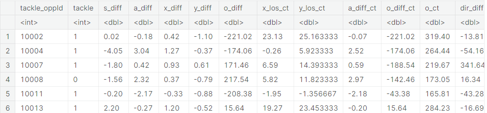

## **Modeling**

With these simple and easy to interpret predictors we modeled to predict a successful tackle. The purpose of this model is not to correctly predict a the result, but to provide interpretable, correct explanation of why the result occured. For analysis features of positive contribution are the coaching points that player did well and negative contribution are coaching points that a player did not do well.

```{r}
library(caret)
library(randomForest)
library(gbm)
library(DALEX)
library(AppliedPredictiveModeling)
#this is the test data from our modeling notebook
#test <- read.csv('~/portfolio_zg/_NFL-Tackling-Evaluation-Folder/final_test.csv')
```

### **Gradient Boost Model**

```{r}
#gbm_model <- readRDS('~/portfolio_zg/_NFL-Tackling-Evaluation-Folder/nfl_gbm_model_total_Jan_less.rds')
#gbm_explain = DALEX::explain(model = gbm_model,
                             #data = test,
                             #y = test$tackle==1,
                             #type = "classification",
                             #label = "GradientBoost")
```

```{r}
#cutoff optomized in seperate notebook
#gbm_perf = DALEX::model_performance(gbm_explain, cutoff = 0.28)
#gbm_perf
```

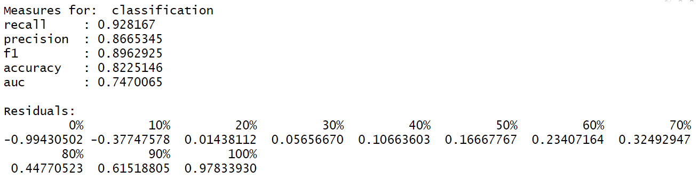

The Gradient Boosted Model has an **82.2% accuracy**.

### **Random Forrest Model**

```{r}
#rf_model<- readRDS('~/portfolio_zg/_NFL-Tackling-Evaluation-Folder/rf_model_total_Jan6_less.rds')
#rf_explain = DALEX::explain(model = rf_model,
                            #data = test,
                            #y = as.numeric(test$tackle=="1"),
                            #type = "classification",
                            #label = "Random Forest")
```

```{r}
#cutoff optomized in seperate notebook
#rf_perf = DALEX::model_performance(rf_explain, cutoff = 0.31)
#rf_perf
```

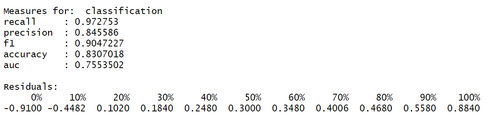

The Random Forrest Model has a **83.1% accuracy**.

### **Model Comparison**

```{r}
library(patchwork)
p1 = plot(rf_perf, gbm_perf, geom = "roc")
p2 = plot(rf_perf, gbm_perf, geom = "prc")
p1 + p2
```

Random Forrest appears to have a slightly better ROC and Precision Recall, along with better accuracy we chose to use our Random Forrest model for application.

# **Application**

This notebook suggests two types application with our model. The applications of this model will demonstrate the practical accuracy of identifying coaching points a player does or does not do well, while also suggesting the widespread potential this model has within all aspect of the NFL.

linkcode

## **Application 1 - Coaching Points On Individual Tackle Attempts**

To demonstrate the practical accuracy of our model for individual predictions we will preform feature analysis on individual tackle attempts.

**How would this apply in the NFL?** Can't the players just go back and watch the play on those sideline tablets? Actually no, the sidline tablets are only aloud to be still images. The purpose of these tablets are to analyze plays and coverages, making technique corrections is difficult to do from still photos. But, what about the coaches/players? Most players and coaches are occupied with other resposabilities such as play calling, signals, or subsitutions. Even on the small chance that someone that is not occupied, the viewing angle paired with the incredible high speed of the game make it difficult to give thourough and meaningful insight.

Our **Example Analysis** will be [this run by D'Andre Swift from week 1 of the 2022 season](https://drive.google.com/file/d/1Cr9L9IE-jni6PJQ-7RjrquImVdjO7q1F/view?usp=sharing). On this play there are 2 missed tackles, the first from James Bradbury #24, the second from Kyzir White #43 before a tackle is made by Darius Slay #2. For each tackle attempt on the play we will preform feature analysis and compare that with the tackler technique coaching points from watching the film many times through. We only choose the top 5 features of importance of each tackle for interpretability.

### **Tackle Attempt 1 - #24 James Bradbury: Result - Missed**

```{r}
#frame_of_tackle <- read.csv('~/portfolio_zg/_NFL-Tackling-Evaluation-Folder/frame_of_tackle_opp_total.csv')
#frame_of_tackle %>% filter(tackle_oppId == 14791, had_tackle_opp ==1) %>% select(tackle_oppId, displayName, jerseyNumber, tackle)
```

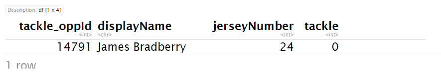

```{r}
#prob_24 = predict(rf_model, newdata =df_to_model[df_to_model$tackle_oppId==14791,], type="prob")[,2]
#break_down_24<- DALEX::predict_parts_shap(rf_explain, df_to_model[df_to_model$tackle_oppId==14791,], B=25)
#plot(break_down_24, add_boxplots = FALSE, max_vars = 5) + 
  #ggtitle(paste("Tackle Report for #24: Prob =", round(prob_24,3)))

```

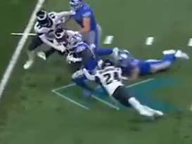

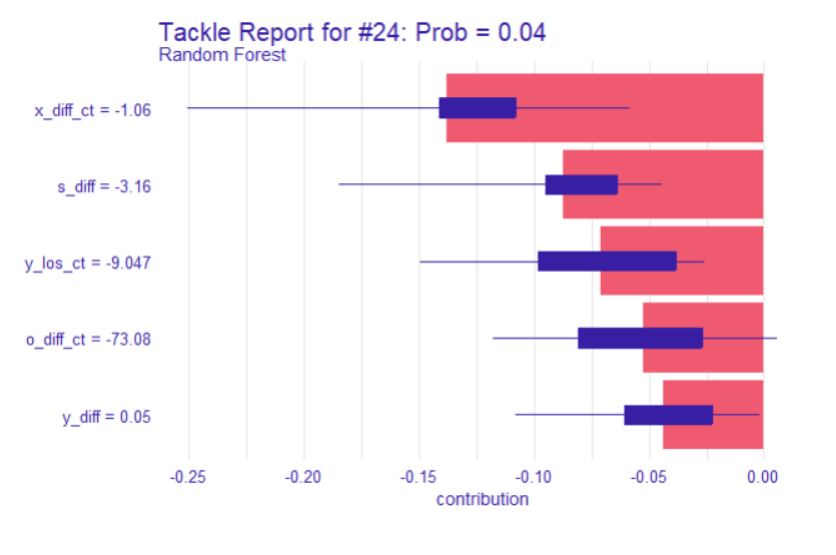

#### **Coaching Points**

1.  If a play call asks a defensive back to make a tackle in the C gap. That is a **difficult task**, the tackler better do everything right. *The C gap marks the **location laterally** the ball carrier went through at the Line of Scrimage*

-   Model recognized `y_los_ct` - location laterally on the field makes this a difficult tackle.

2.  DON'T STOP YOU FEET this is number one rule of tackling! Ball Carrier is going fast, #24 needs to **"run through him" don't stop**.

-   Model recognized `speed_diff` as main feature that is within tackler's control. Large Negative Value signifies Ball Carrier moving much faster than defender.

3.  Bad **angle** of approach put #24 in a bad position to make a tackle. Then lead to **poor shoulder angle** with the ball carrier. Should have "squared him up".

-   Model recognized `x_diff_ct` and `y_diff` as negative features. This akcnowledges the poor angle by #24. Then the model recognizes the poor shoulder angle of defender with a negative `o_diff_ct` contribution

### **Tackle Attempt 2 - #43 Kyzir White: Result - Missed**

```{r}
frame_of_tackle %>% filter(tackle_oppId == 14792, had_tackle_opp ==1) %>% select(tackle_oppId, displayName, jerseyNumber, tackle)
```

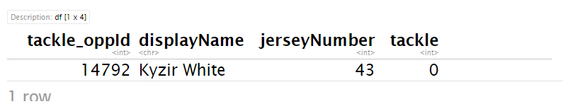

```{r}
#prob_43 = predict(rf_model, newdata =df_to_model[df_to_model$tackle_oppId==14792,], type="prob")[,2]

#break_down_43<- DALEX::predict_parts_shap(rf_explain, df_to_model[df_to_model$tackle_oppId==14792,], B=25)
#plot(break_down_43, add_boxplots = FALSE, max_vars = 5) + 
  #ggtitle(paste("Tackle Report for #43: Prob =", round(prob_43,3)))
```

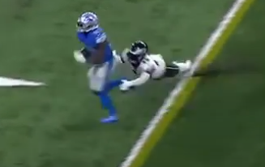

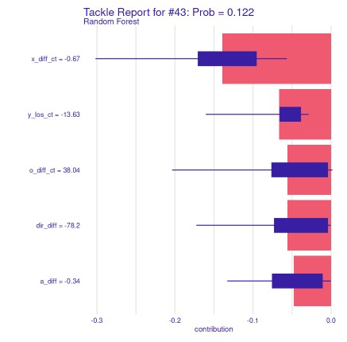

#### **Coaching Points**

1.  This ball carrier is **accelerating up field fast**. #43 needs to take a **better angle**. Bad angle lead to being in a **poor location and shoulder angle** to make a tackle.

-   Model recognized the acceleration with poor angle by negative `a_diff` and`dir_diff` contributions. Along with poor position and `x_diff_ct` shoulder angle `o_diff_ct`

2.  A coach will not admit this because they need their players to make this play. But as players, we will have sympothy for #43 -**this is a really hard tackle**.

-   Model recognized this with `y_los_ct` lateral location on the field difficulty

linkcode

### **Tackle Attempt 3 - #2 Darius Slay: Result - Tackle**

```{r}
#frame_of_tackle %>% filter(tackle_oppId == 14790, had_tackle_opp ==1) %>% select(tackle_oppId, displayName, jerseyNumber, tackle)
#prob_2 = predict(rf_model, newdata =df_to_model[df_to_model$tackle_oppId==14790,], type="prob")[,2]

#break_down_2<- DALEX::predict_parts_shap(rf_explain, df_to_model[df_to_model$tackle_oppId==14790,], B=25)
#plot(break_down_2, add_boxplots = FALSE, max_vars = 5 ) + 
  #ggtitle(paste("Tackle Report for #2: Prob =", round(prob_2,3)))
```

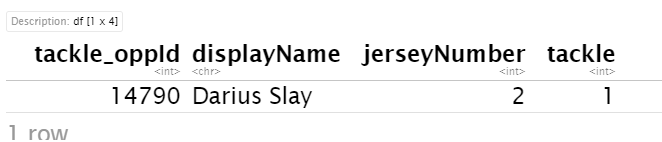

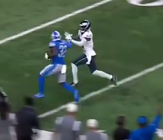

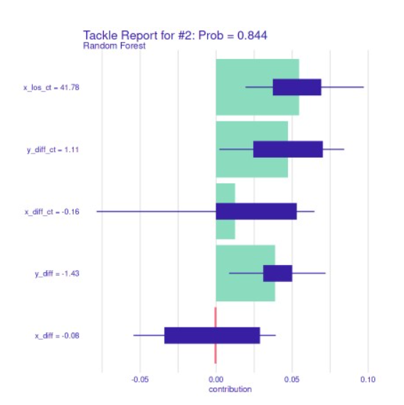

#### **Coaching Points**

1.  Great pursuit angle, great closing angle put #2 in a quality position for a tackle.

-   Model recognizes the great angle that lead to good positioning by`y_diff_ct`, `x_diff_ct`, `y_diff` having positive contrirubtions

-   Model recognized the high probabilty of a tackle that actually did lead to a tackle.

### **Application 1 - Conclusion**

Hopefully by now it is clear, on an individual tackle attempt our model correctly identifies the coaching points that lead to a made or missed tackle. In-game when it is difficult to recieve correct tackling coaching this model could provide valuable feedback to make corrections that will improve defenders play and safety.

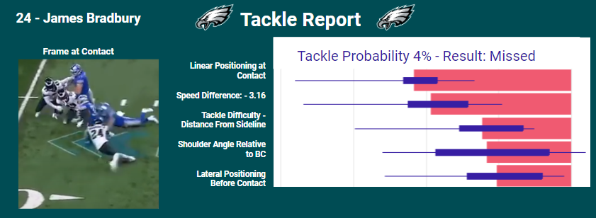

[Example Broadcast Video](https://drive.google.com/file/d/14OFdia0o129dXANbVHeIi7uL3bdIIVqJ/view)

Not only would a report like this improve the quality of play it would enhance the broadcasts as well. Muct like the "catch probabilty metric" a tackle grade would be an exciting new metric while also providing context and insight about quality defensive football. This would also teach the techniques and importance of skillful defensive play for youth plays as well.

## **Application 2 - Overall Defender Tackle Analysis**

If "the best defenses are the best tacklers" not only does a team need to take steps to always improve their tackling, they also need to find the best tacklers to get on their team. Application 1 proved that our model correctly identifies the characteristics that lead to each made or missed tackles on an individual basis. Now taking a cumulation of all tackle attempts we can help identify strengths and weaknesses to rank and score tackling ability of defenders. This notebook will take some examples to demonstrate the accuracy of this application to then suggest the widespread potential from identifing where a player needs to improve to player evalautions and the NFL draft.

### **We will take a data set of all safeties and identify the some with a lot of missed tackles**

```{r}
#safety_df <- read.csv('/kaggle/input/safety-summary/tackle_prob_summary_s.csv')
#safety_df %>% select(tackle_perc, displayName, n, tackles, missed_tackles) %>% filter(tackle_perc<.70)
```

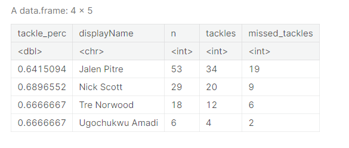

We will analyze Jalen Pitre who has 19 missed tackles and the lowest successfull tackle rate of 64% and Nick Scott who has 9 missed tackles and the 3rd worst successful tackle rate of 69%.

```{r}
safety_df %>% select(tackle_perc, displayName, n, tackles, missed_tackles) %>% filter(displayName == 'Jordan Poyer')
```

To also analyze a good tackler we will also 2022 All-Pro Safety Jordan Poyer who only has 3 missed tackles and a successful tackle rate of 83%.

**For each of these players we ran feature analysis for all tackle attempts and found the average contribution for each characteristic.**

### **Jordan Poyer 83% Tackle Success Rate**

```{r}
#library(ggthemes)

#tackle_prob <- .616 + poyer_df %>% select(contributions) %>% sum()
#poyer_df%>% ggplot( aes( x = variables, y = contributions, fill = as.character(positive))) + geom_bar(stat = "identity")+geom_col() +
 # geom_text(aes(y = contributions/2, label = round(contributions,3)), colour = "black")+ ggtitle(paste("Jordan Poyer Tackle Report Summary \n - Avgerage Tackle Probability", round(tackle_prob,3)))+ theme(legend.position = "none")
```

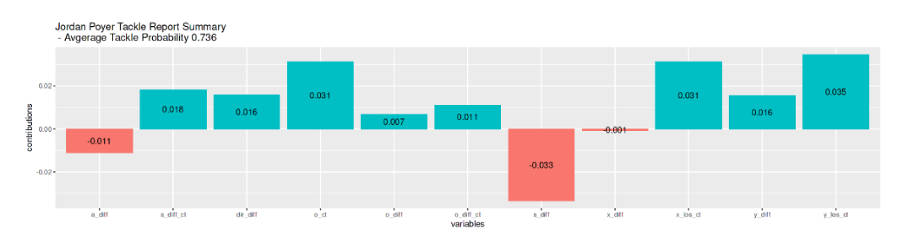

Our model shows why Poyer has a high tackle rate with almost all positive contributions. However lets look into the 2 negative features about his tackling`a_diff` and `s_diff`

```{r}
#set_plot_dimensions <- function(width_choice, height_choice) {
      #options(repr.plot.width=width_choice, repr.plot.height=height_choice }

#set_plot_dimensions(16,4)
#poyer_tackles<- frame_of_tackle_opp%>% filter(displayName == 'Jordan Poyer', had_tackle_opp ==1)%>% pull(tackle_oppId)

#p1<- ggplot() + geom_boxplot(data = df_to_model, aes(x = s_diff, y = tackle_oppId %in% poyer_tackles ))+ xlim(-2.5,2.5) +  scale_y_discrete(labels = c('NFL', 'Jordan Poyer'))+ labs(title = 'Speed Difference: -.033 contribution')+ylab('')

#p2<- ggplot() + geom_boxplot(data = df_to_model, aes(x = a_diff, y = tackle_oppId %in% poyer_tackles ))+ xlim(-2.5,2.5)  +  scale_y_discrete(labels = c("NFL", "Jordan Poyer")) + labs(title = 'Acceleration Diffence: - .011 Contribution')+ylab('')

#p1+p2
```

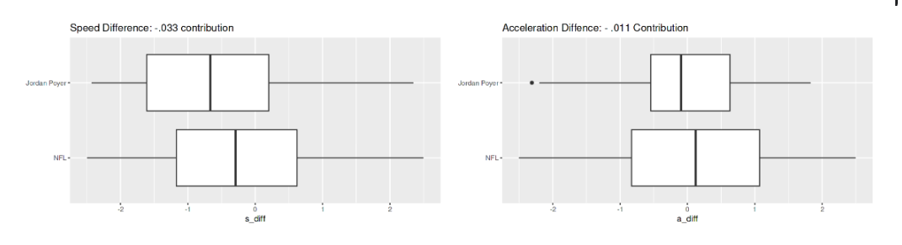

#### **Poyer Model Evaluation Report**

Jordan Poyer shows great technique in tackling, he takes good angles with good body positioning. The only negative features about Jordan Poyers tackling is his speed and acceleration. In both of these categories Jordan Poyer is below the NFL average meaning that Jordan Poyer goes into tackles too slow and not accelerating enough.

#### [**Poyer Draft Scouting report** ](https://bleacherreport.com/articles/1612892-jordan-poyer-scouting-report-nfl-outlook-for-oregon-state-cb)

"Poyer isn't the type of [player] to charge into the middle of the action and blow up a play, but he takes correct angles and puts himself in position to make a play as the last line of defense", "While he isn't exactly eager to take on the ball-carrier, Poyer will step up when needed. He consistently shows correct form and avoids lazy arm tackles"

**Our model correctly identifies Poyers good form and technique, while also highlighting he is not exactly "eager" to tackle shown by his negative contribution of slow `s_diff` and `a_diff`**

### **Jalen Pitre - 64% Tackle Success Rate**

```{r}
#pitre_df <- read.csv('/kaggle/input/pitre-df/pitre_df.csv')
#tackle_prob <- .616 + pitre_df %>% select(contributions) %>% sum()
#pitre_tackles<- frame_of_tackle_opp%>% filter(displayName == 'Jalen Pitre', had_tackle_opp ==1)%>% pull(tackle_oppId)
#pitre_df%>%  ggplot( aes( x = variables, y = contributions, fill = as.character(positive))) + geom_bar(stat = "identity")+geom_col() +
# geom_text(aes(y = contributions/2, label = round(contributions,3)), colour = "black")+ ggtitle(paste("Jalen Pitre Tackle Report Summary \n - Avgerage Tackle Probability", round(tackle_prob,3)))+ theme(legend.position = "none")


```

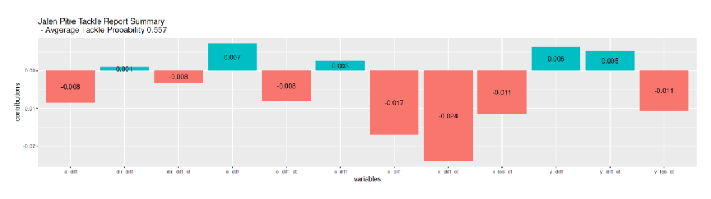

-   First it should be akcnowledge that both `y_los_ct` and `x_los_ct` are high negative contributors. This means Jalen Pitre's defense is asking him to make a lot of difficult tackles.

-   Within Pitre's control is `x_diff`, `x_diff_ct`, `o_diff_ct` which are high negative contributors suggesting he takes back angles.

-   The last negative feature in Pitre's control is `a_diff` we will explore why that is.

```{r}
#ggplot() + geom_boxplot(data = df_to_model, aes(x = as.numeric(a_diff), y = tackle_oppId %in% pitre_tackles ))+ xlim(-2.5,2.5) + scale_y_discrete(labels = c("NFL", "Jalen Pitre")) + labs(title = 'Acceleration Diffence: - .008 Contribution')+ylab('')
```

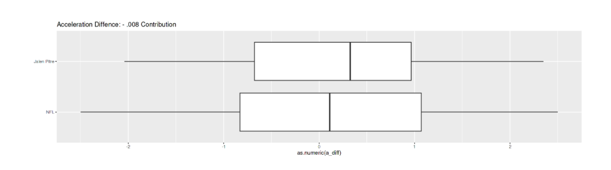

Jalen Pitre overall has a higher accerlation and it negatively contributes to his tackling.

#### **Pitre Model Report**

Jalen Pitre is asked to make a lot of difficult tackles. He takes poor angles and acceleration is too high going into his attempts which cause him to miss tackles.

#### [**Pitre Draft Scouting Report**](https://www.nfl.com/prospects/jalen-pitre/32005049-5408-3599-b04a-4c2328e5af83//)

"Good job of adjusting pursuit angles", "Comes in too hot and too elevated as tackler"

-   **Our model correctly identified Jalen Pitre with a low tackle probabilty as someone who misses a lot of tackes.**

-   **Our model correctly identified Pitre's "comes in too hot" tackle style by a high acceleration leading to a negative contribution to his tackling.**

**The main area of growth for Pitre is his angles demonstrated by `x_diff`, `x_diff_ct` and `o_diff_ct`. This was contrary to his scouting report suggesting his excellence with pursuit angles in college has not translated to the NFL. In 2022 Pitre was a rookie, it is understandable he struggled adjusting his angles to the NFL speed. However, even though it is a negative contributor it is still encouraging that his acceleration is high. As a coach this suggests Pitre has not changed his style of play that made him a productive player in college, he just needs a targeted are of growth in pursuit angles. As a young safety this is exciting because a high acceleration suggests Pitre is eage to tackle, you can teach angles, not eagerness.**

### **Nick Scott - 69% Successful Tackle Rate**

```{r}
#scott_df <- read.csv('/kaggle/input/scott-df-final/scott_df.csv')
#tackle_prob <- .616 + scott_df %>% select(contributions) %>% sum()
#scott_df%>% ggplot( aes( x = variables, y = contributions, fill = as.character(positive))) + geom_bar(stat = "identity")+geom_col() +
 # geom_text(aes(y = contributions/2, label = round(contributions,3)), colour = "black")+ ggtitle(paste("Nick Scott Tackle Report Summary \n - Avgerage Tackle Probability", round(tackle_prob,3)))+ theme(legend.position = "none")
```

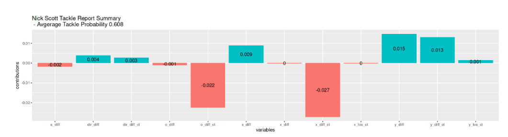

-   The main negative contributor of Nick Scotts poor tackling is `x_diff_ct` suggesting he takes bad angles, however his main positive contributor is `y_diff` with `y_diff_ct` also a high positive contributor which suggest good angles.​

-   The second highest negative contributor is `o_diff_ct` this suggest poor body angle/positioning on tackles.

Often with poor angles being an issue a player also gets hesistant to tackle and his acceleration will decrease. `a_diff` is not a large negative factor so we will look at acceleration to see if Scott is "eager" to tackle or not.

```{r}
#scott_tackles<- frame_of_tackle_opp_total%>% filter(displayName == 'Nick Scott', had_tackle_opp ==1)%>% pull(tackle_oppId)
#ggplot() + geom_boxplot(data = df_to_model, aes(x = a_diff, y = tackle_oppId %in% scott_tackles ))+ xlim(-2.5,2.5) + scale_y_discrete(labels = c("NFL", "Nick Scott")) + labs(title = 'Acceleration Diffence: - .002 Contribution')+ylab('')
```

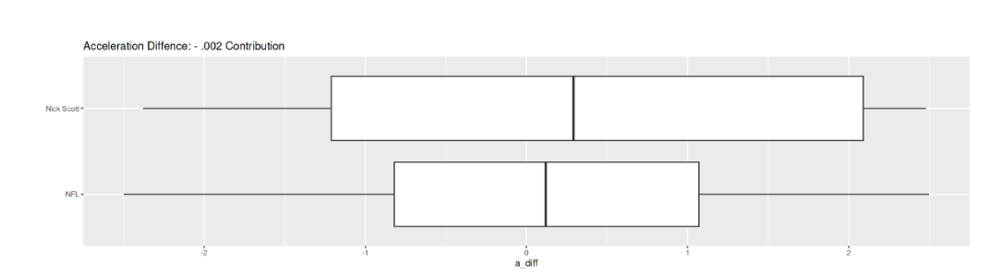

Nick Scott has a higher than normal acceleration, suggesting he remians a non-hesitant tackler suggesting he is a safety that is "eager".

### **Scott Model Report**

Some instances Scott takes poor angles, and others he takes angles the positively contribute. He has poor shoulder angles at contact but is eager to tackle.

### **Scott Draft Scouting Report**

"Looking to close in and smack ball carriers","Inconsistent angles to the football and tackling mechanics"

-   **Our model correctly identified the variability in the quality of Scott's angles.**

-   **The poor tackling mechanices is found by the negative contribution from shoulder angle at contact.**

-   **High acceleration correlates with the scouting report of closing in to smack ball carriers.**

linkcode

### **Application 2 - Conclusion**

When cumulating all contributions our model correctly identified strength and weaknesses of a defenders tackling. Quantatively placing value on tackling strengths and weaknesses has lots of potential applications. Players have good an bad games, players and coaches can usually evaluate individual plays with ease, but overall trends are a lot harder to catch. When quantatively evaluating the most important aspect of defensive football there is a lot of potential, here are some examples.

-   **Cumulative tackling reports from a game** or series of games would help a player to target areas of growth. Even if the player is not missing tackles this can help catch trends before they become a problem and improve overall performance.

-   **Cumulative tackling reports of an entire defense or position group.** This can help grade overall defenses on their tackling strength and weaknesses. Finding high negative contributors tells a coach skills to target during practice or an offense in what ways to attack a defense's tackling.

-   **Cumulative tackling reports for drafting and free agency.** From a player prespective we do not have much specifc insight, however quantatively grading players tackling strength and weaknesses will bring lots of valuing when evaluation, comparing, and projecting players.

## **Next Steps**

-   The most likely area of inconsistency is which frame we classified as **Frame of Conctact**. Given the avalaible features we feel our theory was the best estimation. However, the data is still consistent with frame of contact being 1 yard we feel confident this not introduce any error into our modeling, however further analysis or added `event` options could benefit this project.

-   When evaluating cumulative tackle probability for comparison in Application 2 `x_los_ct` and `y_los_ct` should be removed. These features provide crucial context for feature analysis, however these variables represent difficulty of tackles and are not a result of player performance.

-   The majority of this project took place during our football season. So we had about a month to create this. We would want to spend more time exploring more modeling options and tuning our current models. Further analysis with cumulative tackle grading would help demonstrate the widespread potential application of our model from improving player performance, to player evalution.

## **Conclusion**

Tackle probabilty is an exciting metric to add to broadcasts and evaluate players. The application demonstrations of our model suggest that this tool could be utilized by the NFL in a variety of different applications improving in-game play, overall player development and safety, and player evaluation.

Please check out the rest of r markdowns for all of the work from this project.

[Prep Tracking](./portfolio_zg/_NFL-Tackling-Evaluation-Folder/prep_tracking.html)
