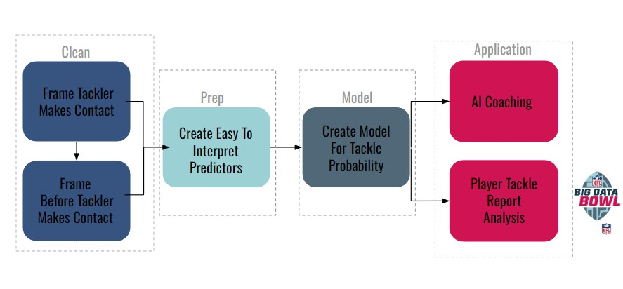

# **Tackle Probabilty Feature Analysis For Coaching And Evaluation**

## **Introduction**

This group has a unique appreciation and understanding of tackling. All three of us are undergraduate students who play football at our university. Between us we have 60 collegiate starts, over 200 collegiate tackles and definitely a few too many missed tackle as well. Our head coach always says "The best defenses are the best tacklers" and "good defense is how you win football games". However, it is simply not that easy, we spend valuable time in practice and in film breakdown learning and correcting the techniques of tackling. Coaching tackling techniques is one of the most debated aspects of defensive football and it is the coaching topic that players are constantly seeking. However, on game day, typically coaches are occupied with their game day roles like play calls or substitutions to provide correct, meaningful feedback from tackle opportunity. Quality tackling is complex, it often takes a coach or player multiple playbacks of watching film after the game to fully evaluate or correct a tackle opportunity. That is why the purpose of this project is to quickly and quantitatively answer the most common question we ask our teammates and coaches, "What happened, did you see how I missed that tackle?"

To answer this question we will create a model with predicting features that are easy to interpret and correlate to coaching points of tackling. Then we will preform feature analysis of an individual tackle opportunity to determine the features or *coaching points* that influenced the result of that tackle oppurtunity.

When quantifying tangible aspects a player does or does not do well it is easy to get excited about the potential analysis from there. The analysis of this project will 1. demonstrate the practical accuracy of the model and 2. provide examples that suggest the wide spread potential of this model for player evaluation.



## **Clean**

The dataframe for our model will consist of data from two frames during the play, the frame as the defender makes contact with the ball carrier and the frame just before a defender makes contact with the ball carrier.

First we must find the frame at which a defender makes contact. With a sample of tracking data the distance from ball carrier,`dist_from_bc` was calculated for all players at each frame. Since there is no `event` in the tracking data that signfies each time a tackler makes contact with the ball carrier, the best we have is when `event` = 'first_contact'. This is the point in the play where the ball carrier is first contacted by a defender. It does not tell us everytime a tackler makes contact with a defender, but it tells us how close a defender is to the ball carrier for PFF to classify a defender as "Made Contact". With this concept we find the average distance PFF classifies a defender making contact and will use this to to classify frames

This data set is a sample of defenders who made first contact and their `dist_from_bc` at `event` = "first_contact"

```{r}
# These lines load packages
rm(list = ls())
library(tidyverse)
first_contact_players_df <- read.csv('~/portfolio_zg/_NFL-Tackling-Evaluation-Folder/first_contact_players_df.csv')

first_contact_players_df %>% ggplot() + geom_boxplot(aes(x = dist_from_bc))+xlim(0,2)
```

```{r}
first_contact_players_df %>% filter(dist_from_bc <2.5) %>% select(dist_from_bc) %>% summary()
```

The Mean `dist_from_bc` is .93. This is the average distance PFF classifies a defender as "making contact with ball carrier". The goal of our model is to be easy to interpret for all audiances, so we will round this to 1. It is much easier to conceptualize our data is from when the defenders tracker is 1 yard away from the ball carrier.

#### **When a tackler is 1 yard from the ball carrier we will consider this "Frame of Contact" the frame immediately before will be considered "Frame Before Contact"**

## **Prep Data For Modeling**

### **Tackle Distinction**

In this project we will **not** use assisted tackles. For a player to be credited with a tackle they must be the solo or primary defender on stopping the ball carrier. Assisted tackles occur if two players contribute "equally" on a tackle. From playing experience we know that being the primary or solo tackler is very different than two players equally contributing on a tackle. Quality assisted tackles require different characteristic, or in our modeling case, different features of importance. Additionally when a ball carrier breaks a tackle it is considered 1 missed tackle. There is no statistic for missed assisted tackles. For these reasons of potential inconsistency and errors we felt it is best to exclude asisted tackles within our model. We do aknowledge that they are a critical part of defense and player evaluation, but we feel a seperate analysis would have to be done for applications like this project.

linkcode

### **Predicting Features For Modeling**

The purpose of this model is to create a score to grade a tackle attempt. Then using feature analysis provide practical explanation of why the tackle attempt went the way it did. This provides quick coaching and quantative values to characteristic of how a player tackles. To provide explanation that is interpretable and actionable we created predictors that are simple and correlate to coaching points of a quality tackle. Including features about other defenders or blockers does not provide actionable feedback or analysis about the tackler and for those reasons were excluded.

Features were selected from both **Frame of Tackle** and **Frame Before Contact**. For each tackle opportunity all tracking features of the tackler and ball carrier were normalized and calculated for differences by `tackler_feature` - `ball_carrier_feature`. Features from **Frame Of Contact** are marked with a `ct` and features from **Frame Before Contact** are unmarked.

#### **For some features the value along with contribution to tackle score will help provide context to grasp the coaching point. Other features looking at a still picture or basic recollection of the play will be necesary.**

**Frame Before Contact**

`s_diff` - speed difference - the value of this feature will provide meaningful context

`a_diff` - acceleration difference - the value of this feature will provide meaningful context

`x_diff` - linear distance apart - this feature represents the quality of approach angle to put tackler in a good linear position to execute a tackle - the value of this feature will not provide meaningful context, a still picture will provide context

`y_diff` - lateral distance apart - this feature represents the quality of approach angle to put himself in a good lateral position to execute a tackle - the value of this feature will not provide meaningful context, a still picture will provide context

`o_diff` - orientation difference - this feature represents the quality of shoulder angle in refrence to the ball carrier - the value of this feature will not provide meaningful context, a still picture will provide context

`dir_diff` - approach angle difference - This feature represents the quality of a defenders angle to prepare to apply force at contact - the value of this feature will not provide meaningful context, a still picture and basic recolection of the play will provide context

**Frame At Contact**

`x_los_ct` - how far down field when contact is made (relative to Line of Scrimage) - This represents tackle difficulty from how far downfield tackle is occuring. This is a feature not neccessarily in the defenders control, but adds important context - the value of this feature will provide meaningful context

`y_los_ct` - how far laterally from the center of the field when contact is made - This represents tackle difficulty from how where on the width of the field the tackler is occuring. This is also feature not neccessarily in the defenders control, but adds important context - the value of this feature will provide meaningful context

`a_diff_ct` - acceleration difference at contact - the value of this feature will provide meaningful context

`o_diff_ct` - orientation difference at contact - This is a defenders shoulder angle in relative to the ball carrier's on contact. This is the common announcer/coach phrase "square him up on contact" - the value of this feature will not provide meaningful context, a still picture and basic recolection of the play will provide context

`o_ct` - orientation of defender at contact - This is the defenders shoulder angle - the value of this feature will not provide meaningful context, a still picture and basic recolection of the play will provide context

```{r}
df_to_model <- read.csv('~/portfolio_zg/_NFL-Tackling-Evaluation-Folder/df_to_model_total.csv')
df_to_model %>% select(-s_diff_ct,-x_diff_ct,-y_diff_ct,-o, -dir_diff_ct) %>% head()
```

## **Modeling**

With these simple and easy to interpret predictors we modeled to predict a successful tackle. The purpose of this model is not to correctly predict a the result, but to provide interpretable, correct explanation of why the result occured. For analysis features of positive contribution are the coaching points that player did well and negative contribution are coaching points that a player did not do well.

```{r}
library(caret)
library(randomForest)
library(gbm)
library(DALEX)
library(AppliedPredictiveModeling)
#this is the test data from our modeling notebook
test <- read.csv('~/portfolio_zg/_NFL-Tackling-Evaluation-Folder/final_test.csv')
```

### **Gradient Boost Model**

```{r}
gbm_model <- readRDS('~/portfolio_zg/_NFL-Tackling-Evaluation-Folder/nfl_gbm_model_total_Jan_less.rds')
gbm_explain = DALEX::explain(model = gbm_model,
                             data = test,
                             y = test$tackle==1,
                             type = "classification",
                             label = "GradientBoost")
```
